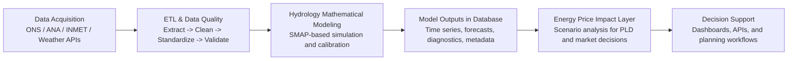

# SMAP Hydrology-to-Energy Analytics Project
This repository contains a practical, end-to-end project for **hydrology data engineering and SMAP-based modeling** with an energy-market perspective. It focuses on building a reproducible workflow that starts with public historical data and ends with analytics outputs that can support electricity price scenario analysis.
## Project Description

flowchart LR

A[Data Sources<br/>Rainfall / Hydrology] --> B[ETL Pipeline<br/>Python (Polars / Pandas)<br/>Ingestion & Transformation]

B --> C[Data Lake<br/>Parquet<br/>Bronze / Silver / Gold]

C --> D[Hydrological Model<br/>R (SMAP Concepts)<br/>Rainfall → Flow]

D --> E[Post-Processing<br/>Python + SQL Logic<br/>Aggregation & Features]

E --> F[Analytics Layer<br/>Dashboards / Data Output]

%% Cross-cutting concerns
G[Logging & Error Handling] --- B
G --- D
G --- E

H[Unit Testing] --- B
H --- E

I[Containerization<br/>Docker + Kubernetes] --- B
I --- D

J[(Future Orchestration<br/>Airflow / Prefect)] -.-> B
J -.-> D
J -.-> E

## Features
1. **Data acquisition and ETL**
   - Ingest historical hydrology and weather datasets from configurable sources (local files or URLs).
   - Apply quality checks, schema normalization, and filtering for basin/reservoir-specific analysis.

## How to Run
2. **Hydrology mathematical modeling (SMAP)**
   - Prepare datasets for SMAP ingestion.
   - Support calibration/backtesting workflows (e.g., projected vs realized streamflow).

3. **Operational data products**
   - Export per-variable and unified datasets for downstream model and analytics services.
   - Keep outputs ready for database loading and reproducible pipeline execution.

4. **Energy-price impact analysis layer**
   - Connect hydrology scenarios to electricity-market interpretation (e.g., PLD-oriented scenario studies).
   - Enable decision-support use cases through APIs and dashboards.

## Repository Components

- `smap_ingestion_pipeline.py` — configurable ingestion and normalization pipeline.
- `configs/smap_pipeline.example.json` — ready-to-edit JSON configuration example.
- `configs/smap_pipeline.example.yaml` — optional YAML configuration example.
- `SMAP_PIPELINE.md` — pipeline guide with execution instructions and outputs.
- `requirements.txt` — Python dependencies for the pipeline and existing demo assets.

## Quick Start

```bash
pip install -r requirements.txt
python smap_ingestion_pipeline.py --config configs/smap_pipeline.example.json
```

## Deploy

## SMAP Data Ingestion Pipeline

This repository now includes a Python pipeline to extract and normalize historical hydrology datasets for SMAP ingestion.

- Script: `smap_ingestion_pipeline.py`
- Example config: `configs/smap_pipeline.example.json`
- Guide: `SMAP_PIPELINE.md`

Run:

```bash
pip install -r requirements.txt
python smap_ingestion_pipeline.py --config configs/smap_pipeline.example.json
```

## End-to-End Hydrology-to-Energy Pipeline (Architecture)

The pipeline below summarizes the full lifecycle from public data acquisition to energy-price impact analysis.



### What each stage delivers

- **Data Acquisition + ETL:** reproducible ingestion pipelines with schema mapping, filters, and quality checks.
- **Hydrology Modeling:** mathematically grounded simulation/forecasting runs (SMAP) with calibration and validation.
- **Database Outputs:** structured outputs ready for analytics services and operational consumption.
- **Energy Price Impact:** translation of hydrology scenarios into energy-market interpretation and decision inputs.


# SMAP Extraction and Ingestion Pipeline

This project includes a Python pipeline to prepare historical datasets (streamflow, precipitation, and ETP)
for SMAP ingestion studies.

## What the pipeline does

1. Reads multiple sources (local file or URL) from a config file.
2. Applies column-based filters (for example, `reservoir = Furnas`).
3. Normalizes columns into a common schema:
   - `date`
   - `value`
   - `station` (optional)
   - `basin` (optional)
   - `variable`
   - `source`
4. Exports one file per variable and one unified ingestion file.

## Main files

- `smap_ingestion_pipeline.py`: pipeline script.
- `configs/smap_pipeline.example.json`: JSON config example.
- `configs/smap_pipeline.example.yaml`: YAML config example.

## How to run

```bash
pip install -r requirements.txt
python smap_ingestion_pipeline.py --config configs/smap_pipeline.example.json
```

## Outputs

Generated under `data/processed`:

- `historical_streamflow.csv`
- `historical_precipitation.csv`
- `historical_etp.csv`
- `smap_ingestion_unified.csv`

## Notes

- The pipeline requires explicit source-to-schema mapping under `schema`.
- Minimum variables expected for full SMAP ingestion are:
  `streamflow`, `precipitation`, and `etp`.
- YAML support is optional and requires `PyYAML`; JSON works out-of-the-box.